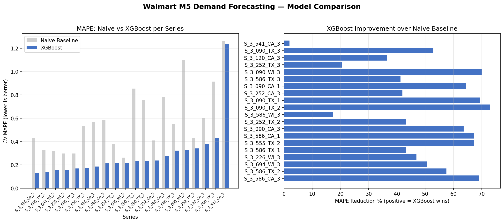

# Walmart M5 Demand Forecasting

> Forecasted daily unit sales across 20 Walmart product-store combinations using XGBoost with walk-forward cross-validation — reducing forecast error by up to 70% over a naive baseline and identifying which series are reliably predictable vs inherently noisy.


---

## Forecast Results



---

## Key Findings

- **XGBoost beat the naive baseline on every single series** — selected as best model across all 20 product-store combinations
- **Best series (FOODS\_3\_586\_CA\_3):** MAPE dropped from 0.43 to 0.13 — a 70% reduction in forecast error
- **Typical improvement:** MAPE reduced from 0.30–1.10 down to 0.13–0.43 across most series
- **Hard series identified:** FOODS\_3\_541\_CA\_3 remains difficult for both models (MAPE ~1.24) due to intermittent, high-variance demand — flagged with diagnostic suggestions in the notebook
- **Lag and rolling features** (lags 1–28, rolling mean/std) were the strongest predictors — outweighing calendar and price signals on most series

**Operational insight:** High-volume stable products (FOODS\_3\_586 family) are reliably forecastable at 13–20% MAPE — sufficient accuracy for inventory planning. Intermittent demand series require separate treatment, such as Croston's method or safety stock buffers.

---

## Model Comparison

| Series | Naive MAPE | XGBoost MAPE | Improvement |
|---|---|---|---|
| FOODS\_3\_586\_CA\_3 | 0.43 | **0.13** | 70% |
| Typical range | 0.30–1.10 | 0.13–0.43 | ~50–60% |
| FOODS\_3\_541\_CA\_3 | 1.26 | 1.24 | ~2% |

> Walk-forward CV with 3 folds and 28-day horizon per fold.
> XGBoost selected as best model for all 20 series by mean CV MAPE.
> Full per-series results in `reports/model_comparison.csv`.

---

## Why This Approach

| Decision | Reason |
|---|---|
| Walk-forward CV over random split | Time series cannot be split randomly — future data must never appear in training |
| Naive baseline | Establishes a floor — any useful model must beat "repeat last value" |
| Lag features (1–28 days) | Captures weekly seasonality and recent demand momentum |
| Rolling mean/std features | Smooths noise and captures demand volatility per series |
| Per-series models | Product-store combinations have different demand patterns — one global model would underfit |
| MAPE as primary metric | Scale-independent — comparable across series with different sales volumes |

---

## Feature Engineering

All features built without future leakage — transformations fit on training window only:

- **Calendar:** day of week, month, year, week of year
- **Events:** SNAP flags, national and religious event indicators
- **Price:** sell price, price change from previous week
- **Lag features:** sales at lags 1, 7, 14, 21, 28 days
- **Rolling features:** 7-day and 28-day rolling mean and standard deviation

---

## Project Structure
```
walmart-demand-forecast/
│
├── src/                        # Training, feature engineering, evaluation modules
├── models/m5/                  # Versioned XGBoost model registry per series
├── reports/
│   ├── forecast_comparison.png # Model comparison visualization
│   └── model_comparison.csv    # Per-series CV MAPE, RMSE, best model
├── requirements.txt
└── README.md
```

---

## Run Locally

### Install dependencies
```bash
pip install -r requirements.txt
```

### Download dataset
Download from [Kaggle M5 competition](https://www.kaggle.com/competitions/m5-forecasting-accuracy/data) and place files in `data/`.

### Train models
```bash
python src/train.py
```

### Generate comparison plot
```bash
python plot.py
```


## Tech Stack

| Layer | Tools |
|---|---|
| Modeling | XGBoost, scikit-learn |
| Feature Engineering | Pandas, NumPy |
| Evaluation | Walk-forward CV, MAPE, RMSE |
| Visualization | Matplotlib |
| Notebook | Jupyter |
| Language | Python 3.9+ |

---

## What Makes This Different

Most forecasting projects use a single train/test split and report one MAPE number. This one:

- **Uses walk-forward CV** — the only correct way to evaluate time series models
- **Benchmarks against a naive baseline** — quantifies real improvement, not just raw accuracy
- **Trains per-series models** — respects that different products have different demand patterns
- **Flags hard series explicitly** — honest about where the model struggles and why
- **Builds features without leakage** — all lag/rolling transforms fit on training window only